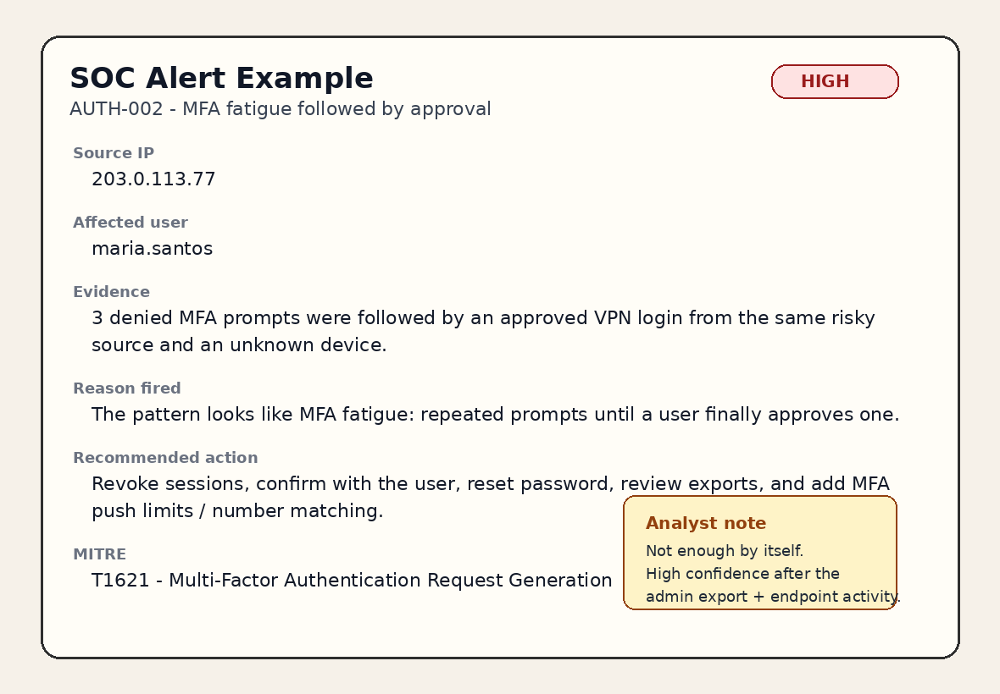
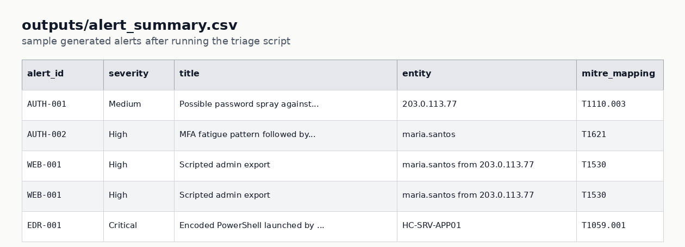
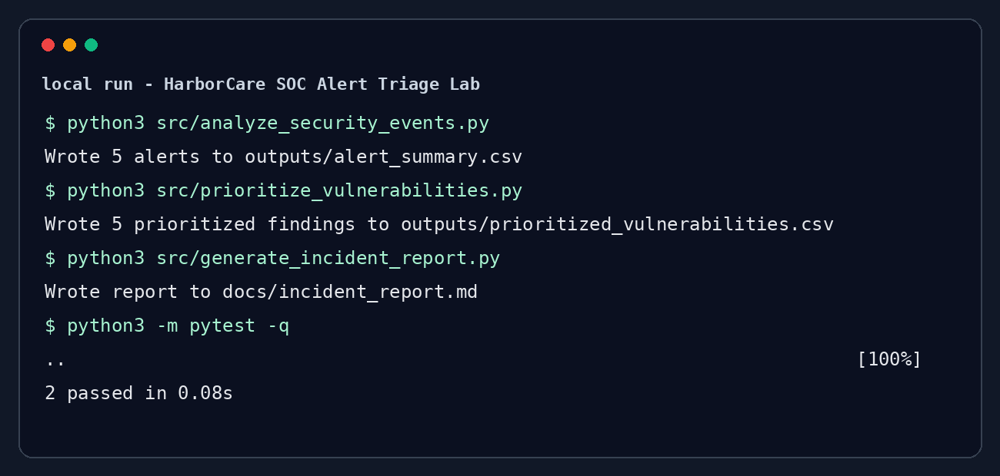
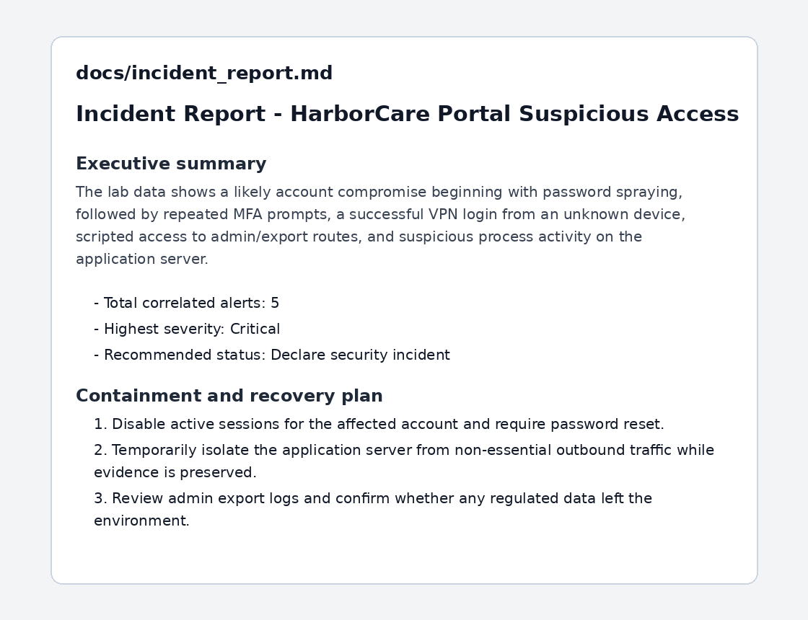
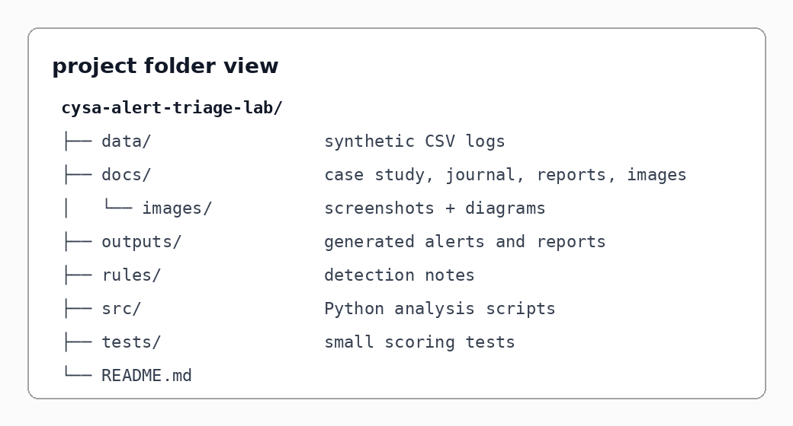
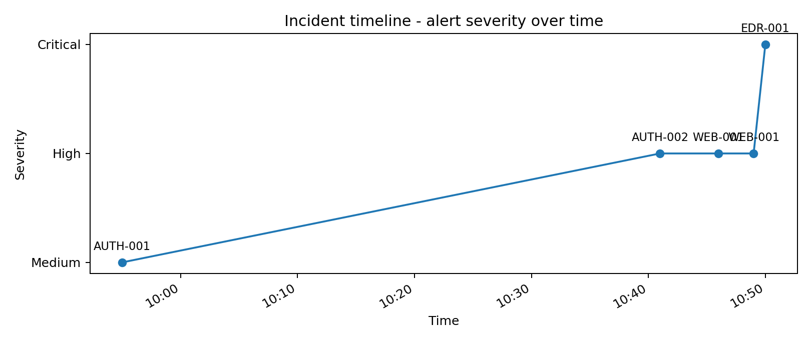
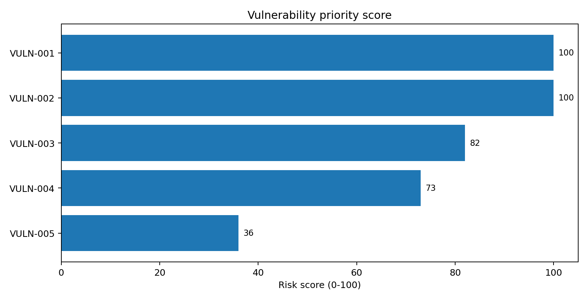
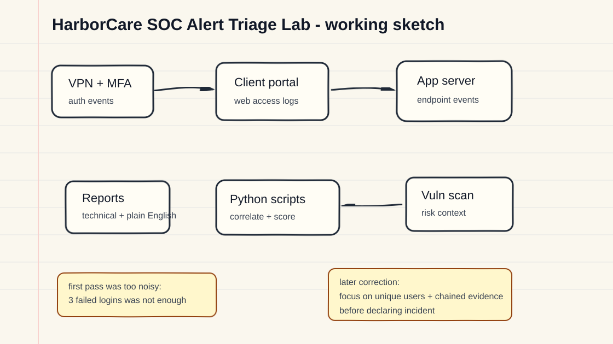
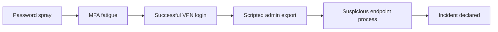
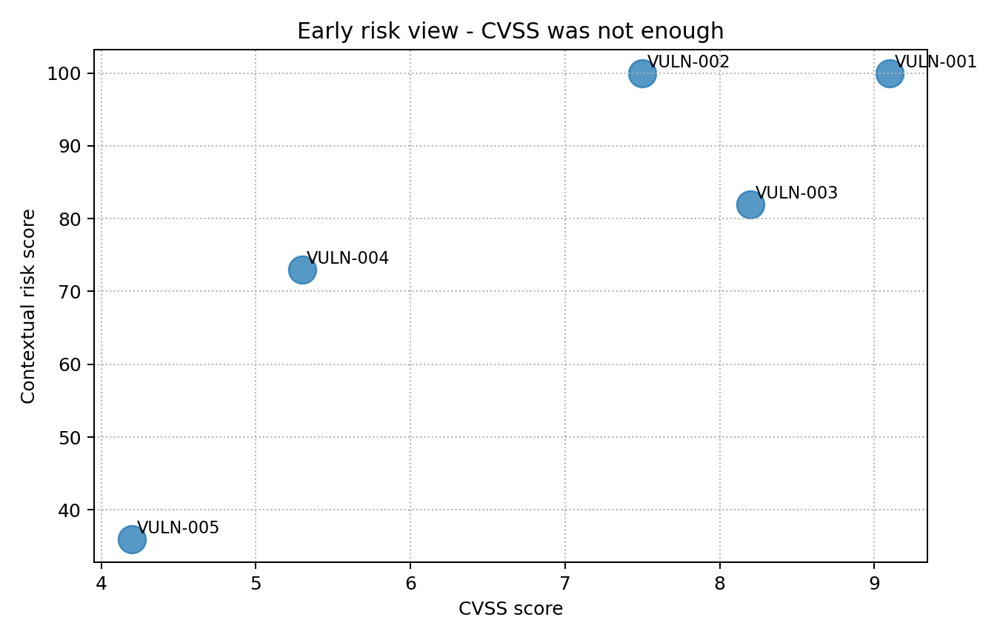

<div align="center">

# HarborCare SOC Alert Triage Lab

**A hands-on blue-team portfolio project for CySA+-level skills**  
Security operations + alert triage + vulnerability prioritization + incident response + plain-English reporting

    

</div>

---

## What this project demonstrates



This project is a small SOC-style investigation using synthetic logs from a fictional healthcare SaaS company called **HarborCare**. I built it to show how I would move from raw alerts to a defensible analyst decision: what happened, why it matters, what evidence supports it, and what I would recommend next.

The scope is intentionally focused on junior SOC workflows. This is not an exploit lab. The project demonstrates practical analyst habits: log review, alert triage, basic detection logic, vulnerability prioritization, incident documentation, and clear communication.

---

## Skills used

| Skill | How it shows up here |
|---|---|
| Log analysis | Reviewed synthetic VPN, MFA, web access, and endpoint logs. |
| Alert triage | Separated normal noise from suspicious patterns and chained evidence. |
| Incident documentation | Wrote a technical incident report and a plain-English explainer. |
| MITRE ATT&CK | Mapped suspicious behaviors to relevant ATT&CK techniques. |
| Vulnerability prioritization | Ranked findings using CVSS plus exposure, exploitability, and business context. |
| Python | Parsed CSV data, generated alert summaries, scored vulnerabilities, and produced reports. |
| Detection engineering | Built and tuned simple detection logic instead of relying only on raw log volume. |
| Security reporting | Explained risk, impact, and next steps in a way a non-technical person could follow. |

---

## Quick visual tour

| Raw alert output | Terminal run |
|---|---|
|  |  |

| Incident report | Project folder |
|---|---|
|  |  |

| Timeline | Risk heatmap |
|---|---|
|  |  |

---

## Why I built this

A lot of beginner cybersecurity projects either look too simple or try to look more advanced than they really are. I wanted this project to remain realistic, explainable, and transparent about its limitations.

The scenario is simple on purpose: an employee account shows signs of password spraying, MFA fatigue, suspicious admin export activity, and risky endpoint behavior on an application server.

The investigation starts with one basic question:

> Is this just noisy authentication activity, or is there enough evidence to declare an incident?

---

## Scenario overview



**Fictional environment:**

- Remote users authenticate through VPN and MFA.
- A client portal handles scheduling and account workflows.
- The app server talks to an internal database.
- Endpoint logs are available for the app server.
- Vulnerability scan output exists, but it needs prioritization.

---

## One example SOC alert

| Field | Detail |
|---|---|
| Alert | MFA fatigue pattern followed by approval |
| Severity | High |
| Source IP | 203.0.113.77 |
| Affected user | maria.santos |
| Evidence | 3 denied MFA prompts before an approved VPN login from the same source and an unknown device. |
| Reason fired | Repeated MFA prompts followed by approval can indicate MFA fatigue, especially when it follows password spraying. |
| Recommended action | Revoke sessions, confirm with the user, reset password, review exports, and add MFA push limits / number matching. |
| MITRE ATT&CK | T1621 - Multi-Factor Authentication Request Generation |

I would not declare an incident from this one alert alone. What made the case stronger was the chain: password spray activity, MFA fatigue, successful VPN login, scripted admin export, and suspicious endpoint process behavior.

---

## Main findings

| Finding | Severity | Why I cared |
|---|---|---|
| Password spray against VPN | Medium | One source IP failed across many accounts in a short window. |
| MFA fatigue followed by approval | High | A user denied multiple prompts, then an unknown device was approved. |
| Scripted admin export | High | The same risky source used `curl` and `python-requests` to access export/report routes. |
| Encoded PowerShell from web worker | Critical | A web process started encoded PowerShell on the app server, which is high-risk behavior. |
| Exposed vulnerable upload component | P1 | Internet-facing, high-value app server, known exploitation flag in the sample data. |

---

## How to run it

```bash
git clone https://github.com/JarthurLabs/Cysa-Alert-Triage-Lab.git
cd cysa-alert-triage-lab
python3 src/analyze_security_events.py
python3 src/prioritize_vulnerabilities.py
python3 src/generate_incident_report.py
```

Optional test run:

```bash
python3 -m pytest tests/
```

No external Python packages are required for the core scripts.

---

## Project structure

```text
cysa-alert-triage-lab/
├── data/                         # Synthetic logs and asset/vulnerability data
├── docs/                         # Reports, journal, diagrams, and explainer
│   └── images/                   # Visuals used in the README and docs
├── outputs/                      # Generated alert summaries and reports
├── rules/                        # Sigma-inspired detection notes
├── src/                          # Python scripts
├── tests/                        # Small tests for scoring logic
└── README.md
```

---

## Visual investigation notes

### Alert flow



### Timeline


### Vulnerability priority view

The first version was basically a CVSS view. It helped, but it did not explain why an internet-facing app server was more urgent than a quieter internal finding.



The improved version adds business and exposure context.


---

## What I got wrong first

The first version of my password-spray logic was too sensitive. I flagged three failed logins in ten minutes, but that caught normal user mistakes. I changed the logic to focus on one source IP failing across five or more unique users in twenty minutes.

I also reconsidered the MFA threshold. My first idea was to treat a few denied prompts followed by approval as high confidence by itself. That was too aggressive. The alert became much more meaningful only after it lined up with the same risky source IP, the successful VPN login, scripted export activity, and endpoint evidence.

Those corrections made the project better because they moved the work from “technically true” to “actually useful for an analyst.” I kept the mistakes in `docs/analyst_journal.md` because the tuning process is more honest than pretending the first idea was perfect.

---

## Defensive references used

- [MITRE ATT&CK](https://attack.mitre.org/) for mapping observed behavior to tactics and techniques.
- [NIST SP 800-61 Rev. 3](https://nvlpubs.nist.gov/nistpubs/specialpublications/nist.sp.800-61r3.pdf) for incident response framing.
- [CISA Known Exploited Vulnerabilities Catalog](https://www.cisa.gov/known-exploited-vulnerabilities-catalog) as the reason this lab includes known-exploitation context in vulnerability prioritization.

---

## Planned improvements

- Add a small Splunk or Elastic version of the same detections.
- Convert the detection notes into formal Sigma rules.
- Add a dashboard screenshot from a SIEM-style view.
- Add a short video walkthrough explaining the triage path.
- Add a second case with a benign false positive so the repo shows both escalation and closure.

---

## Important note

All data in this repo is synthetic and created for defensive learning. The company, users, systems, IPs, and events are fictional. No real customer or patient data is included.