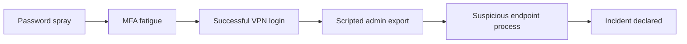

<div align="center">

# HarborCare Alert Triage Lab

**A hands-on blue-team portfolio project for CySA+-level skills**  
Security operations + vulnerability prioritization + incident response + plain-English reporting

   

</div>

---

## Why I built this

I wanted a project that felt closer to the work a junior security analyst might actually do: review messy logs, separate noise from risk, explain why something matters, and recommend the next action without sounding dramatic.

This is not an exploit lab. It is a defensive investigation using synthetic data from a fictional healthcare SaaS company called **HarborCare**. The scenario is simple on purpose: an employee account shows signs of password spraying, MFA fatigue, suspicious admin export activity, and risky endpoint behavior on an application server.

The goal was to show practical CySA+-style skills without pretending to be a senior incident responder.

---

## What this project demonstrates

| Skill area | What I did in the project | Where to look |
|---|---|---|
| Security operations | Parsed auth, web, and endpoint logs; wrote detection logic; triaged alerts | `src/analyze_security_events.py`, `rules/detection_rules.yml` |
| Vulnerability management | Prioritized findings using CVSS plus business context, exposure, exploitability, and asset value | `src/prioritize_vulnerabilities.py`, `outputs/prioritized_vulnerabilities.csv` |
| Incident response | Built an evidence timeline, recommended containment, and documented lessons learned | `docs/incident_report.md`, `docs/analyst_journal.md` |
| Reporting and communication | Wrote a technical report and a non-technical explanation | `docs/nontechnical_explainer.md` |
| Python scripting | Used standard-library Python so the project is easy to run and review | `src/` |
| Detection tuning | Documented where my first logic was too noisy and how I corrected it | `docs/analyst_journal.md` |

---

## Scenario overview


**Fictional environment:**

- Remote users authenticate through VPN and MFA.
- A client portal handles scheduling and account workflows.
- The app server talks to an internal database.
- Endpoint logs are available for the app server.
- Vulnerability scan output exists, but it needs prioritization.

The case starts with a basic question:

> Is this just noisy authentication activity, or is there enough evidence to declare an incident?

---

## Main findings

| Finding | Severity | Why I cared |
|---|---|---|
| Password spray against VPN | Medium | One source IP failed across many accounts in a short window. |
| MFA fatigue followed by approval | High | A user denied multiple prompts, then an unknown device was approved. |
| Scripted admin export | High | The same risky source used `curl` and `python-requests` to access export/report routes. |
| Encoded PowerShell from web worker | Critical | A web process started encoded PowerShell on the app server, which is high-risk behavior. |
| Exposed vulnerable upload component | P1 | Internet-facing, high-value app server, known exploitation flag in the sample data. |

---

## How to run it

```bash
git clone <your-repo-url>
cd cysa-alert-triage-lab
python3 src/analyze_security_events.py
python3 src/prioritize_vulnerabilities.py
python3 src/generate_incident_report.py
```

Optional test run:

```bash
python3 -m pytest tests/
```

No external Python packages are required for the core scripts.

---

## Project structure

```text
cysa-alert-triage-lab/
├── data/                         # Synthetic logs and asset/vulnerability data
├── docs/                         # Reports, journal, diagrams, and explainer
│   └── images/                   # Visuals used in the README and docs
├── outputs/                      # Generated alert summaries and reports
├── rules/                        # Sigma-inspired detection notes
├── src/                          # Python scripts
├── tests/                        # Small tests for scoring logic
└── README.md
```

---

## Visual investigation notes

### Alert flow



### Timeline


### Vulnerability priority view


---

## What I got wrong first

The first version of my password-spray logic was too sensitive. I flagged three failed logins in ten minutes, but that caught normal user mistakes. I changed the logic to focus on one source IP failing across five or more unique users in twenty minutes.

That correction made the project better because it moved the rule from “technically true” to “actually useful for an analyst.”

I kept the mistake in `docs/analyst_journal.md` because I think the tuning process is more honest than pretending the first idea was perfect.

---

## Defensive references used

- [MITRE ATT&CK](https://attack.mitre.org/) for mapping observed behavior to tactics and techniques.
- [NIST SP 800-61 Rev. 3](https://nvlpubs.nist.gov/nistpubs/specialpublications/nist.sp.800-61r3.pdf) for incident response framing.
- [CISA Known Exploited Vulnerabilities Catalog](https://www.cisa.gov/known-exploited-vulnerabilities-catalog) as the reason this lab includes known-exploitation context in vulnerability prioritization.

---

## What I would improve next

- Add a small Splunk or Elastic version of the same detections.
- Convert the detection notes into formal Sigma rules.
- Add a dashboard screenshot from a SIEM-style view.
- Add a short video walkthrough explaining the triage path.
- Add a second case with a benign false positive so the repo shows both escalation and closure.

---

## Important note

All data in this repo is synthetic and created for defensive learning. The company, users, systems, IPs, and events are fictional. No real customer or patient data is included.
