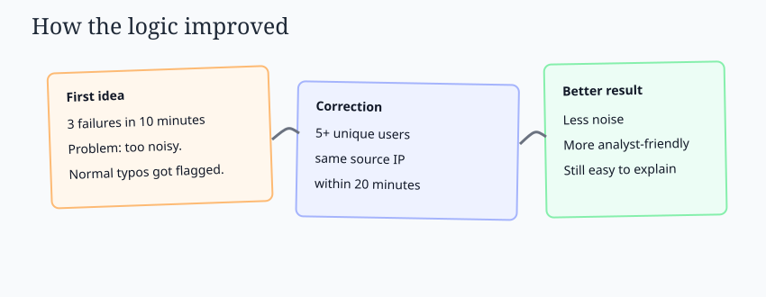
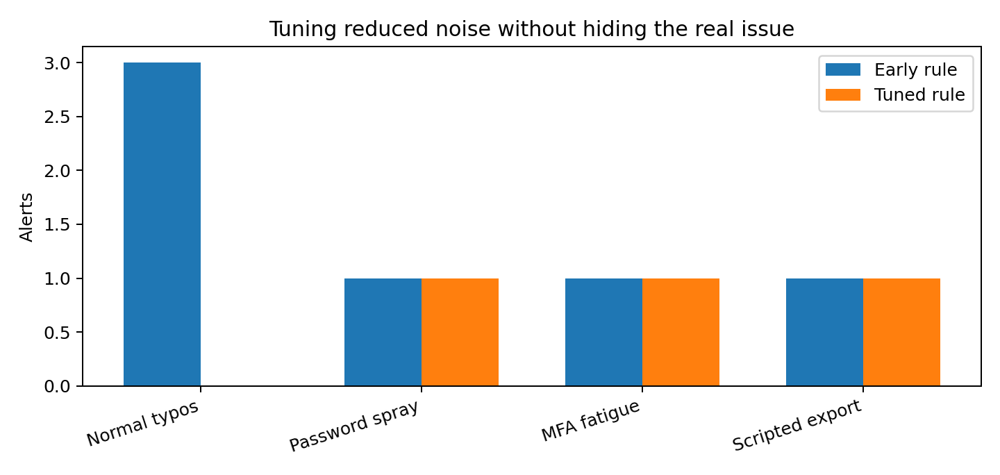

# Analyst Journal - Iterations, Mistakes, and Corrections

I wanted this project to show the work, not just the final answer. A real analyst rarely gets a clean story immediately. The first pass usually has assumptions that need to be tested.

## Iteration 1 - I over-alerted on failed logins

My first rule was:

> Alert when one source IP has 3 failed logins in 10 minutes.

That sounded reasonable at first, but it caught too much normal noise. People mistype passwords. Password managers fail. Someone may have recently changed a password and still be using the old one on another device.

### Correction

I changed the logic to:

> Alert when one source IP has failed logins across 5 or more unique users within 20 minutes.

That better matches password spraying because the pattern is not just failure volume. The important part is one source trying many accounts.

## Iteration 2 - I almost ranked vulnerabilities by CVSS only

At first, I sorted vulnerability findings by CVSS. That was easy, but it missed the bigger point.

A high CVSS issue on an internal, segmented server may be less urgent than a slightly lower-scored issue on an internet-facing production system with exploit activity.

### Correction

I added context:

- Known exploitation
- Exploit availability
- Internet exposure
- Asset criticality
- Existing compensating controls

That made the priority list more realistic.

## Iteration 3 - I made the report too technical

My first incident report was mostly alert names, MITRE mappings, and log evidence. That is useful for an analyst, but not enough for a manager or recruiter trying to understand the project quickly.

### Correction

I added an executive summary, a plain-English risk explanation, and a short containment plan. I kept the technical evidence, but I stopped leading with it.

## Iteration 4 - I reconsidered the MFA threshold

My first MFA fatigue idea was too blunt:

> Alert on 2 denied prompts followed by 1 approval.

That catches real risk, but it can also catch normal behavior. A user might deny a prompt because they were not ready, had a bad phone signal, or tapped the wrong option.

### Correction

I kept the alert, but I changed how I treated it. Two or three denied prompts are a signal, not a full conclusion. I only treated the case as high confidence after the MFA activity lined up with the same source IP, a successful VPN login, scripted export behavior, and endpoint evidence.

That was a useful lesson: sometimes the right fix is not only changing the rule. It is changing how much confidence I assign to the rule.

## What I learned

- Detection logic needs tuning, not just writing.
- Vulnerability management is a business decision, not only a scanner output.
- Incident response documentation should explain what happened, why it matters, and what to do next.
- Good communication is part of the security work.

## Visual note on tuning

